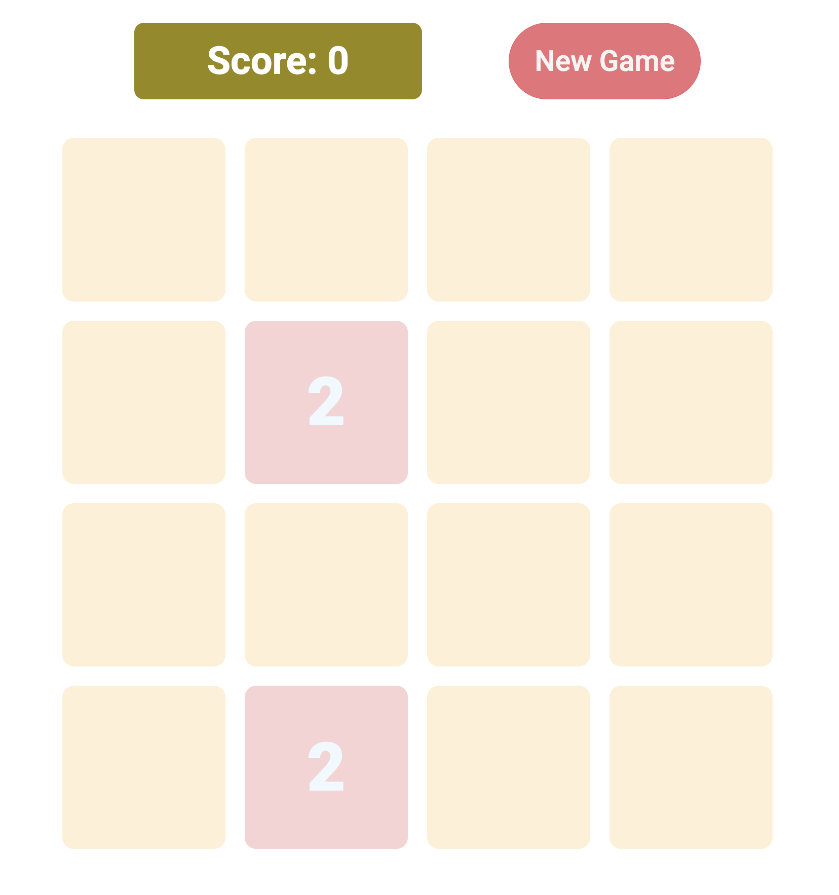
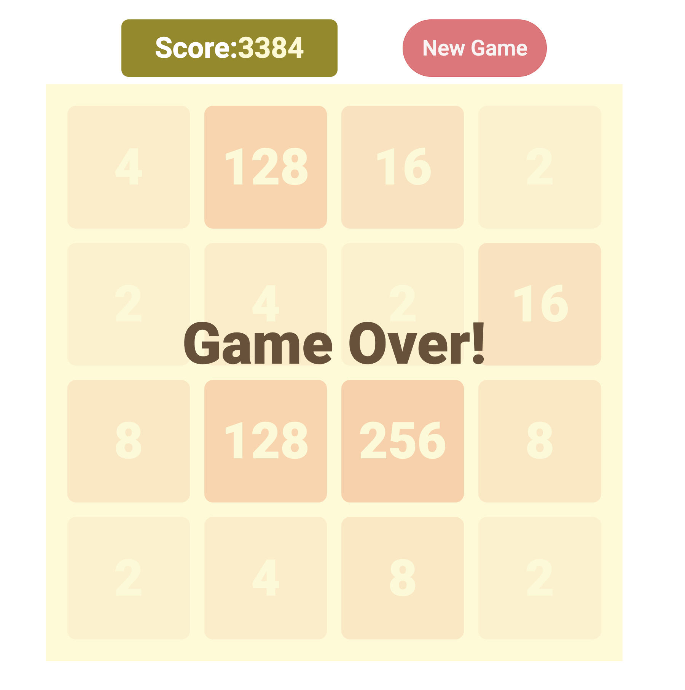

# 2048
This is my version of the [2048 game.](https://play2048.co/).
Use the arrow keys to merge tiles with the same number until you reach 2048, but be careful not to run out of space!

# Screenshot

# Technologies Used

- JavaScript
- HTML
- CSS

# Getting Started

[Click to Play 2048!](https://andreamaciasr.github.io/2048/)

# Next Steps

- Refactor the code to make it more DRY.
- Add animation when a tile is merged.